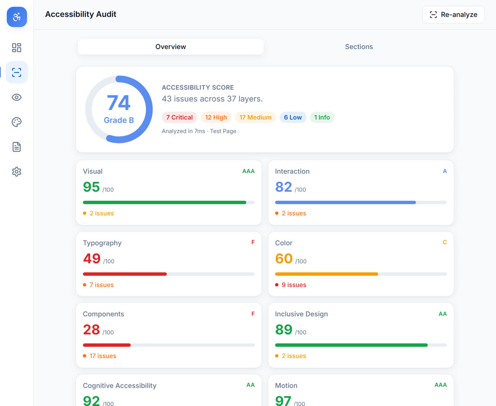
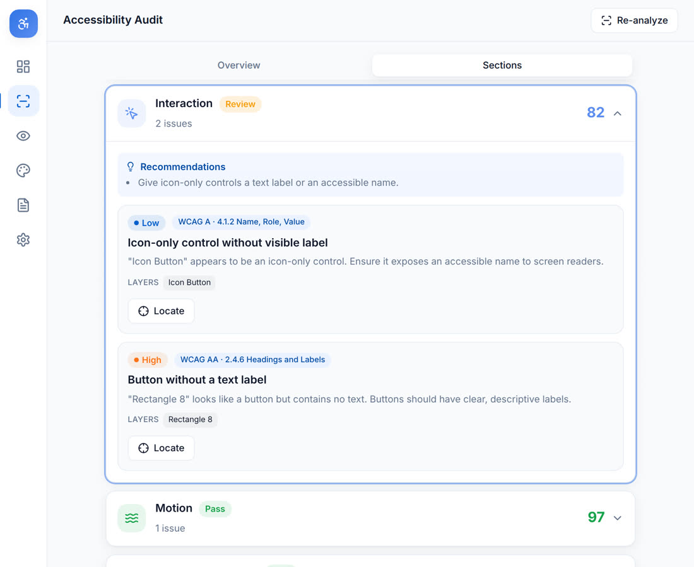
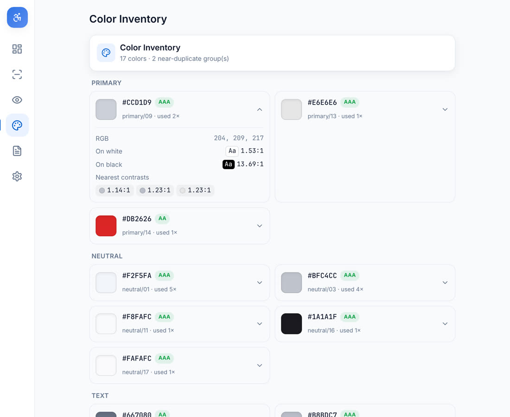
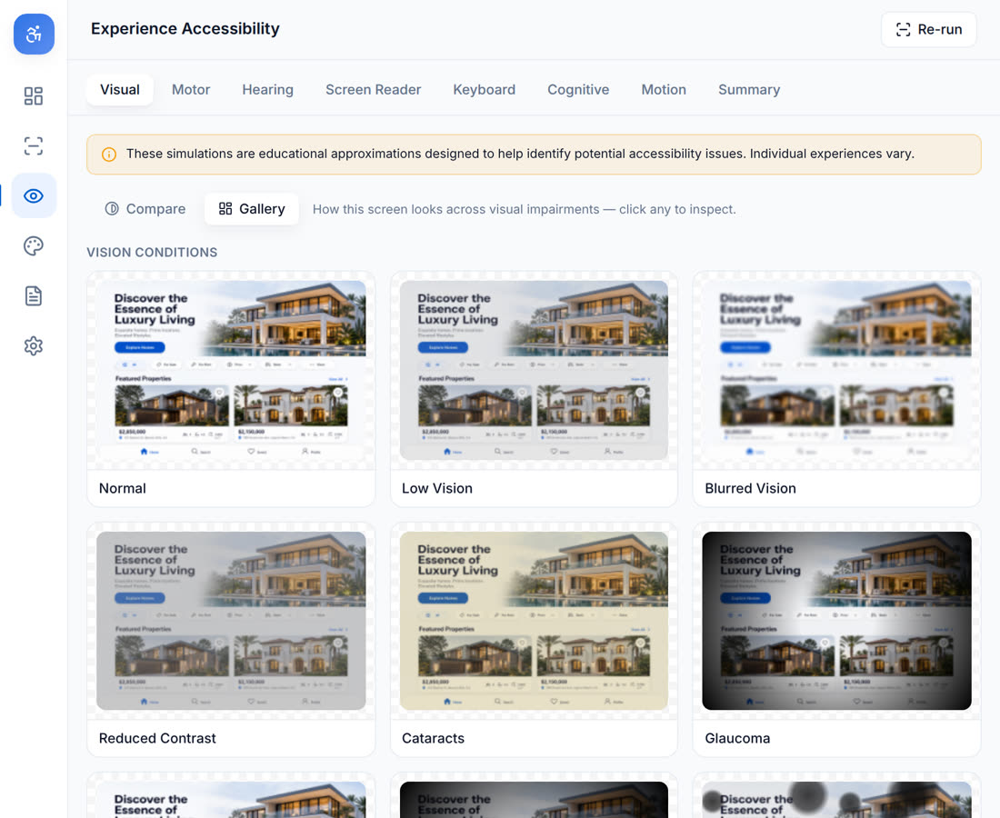
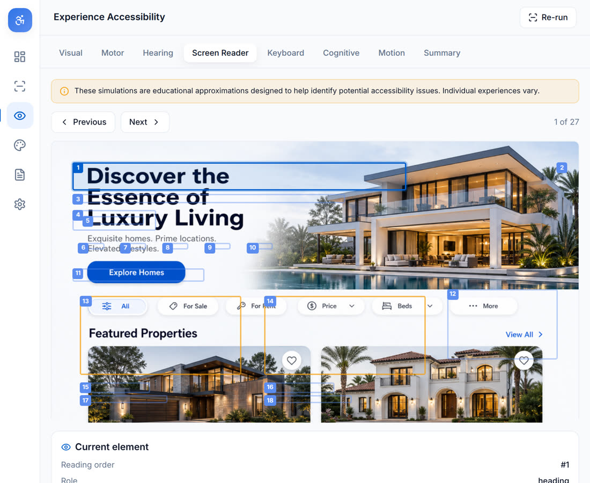
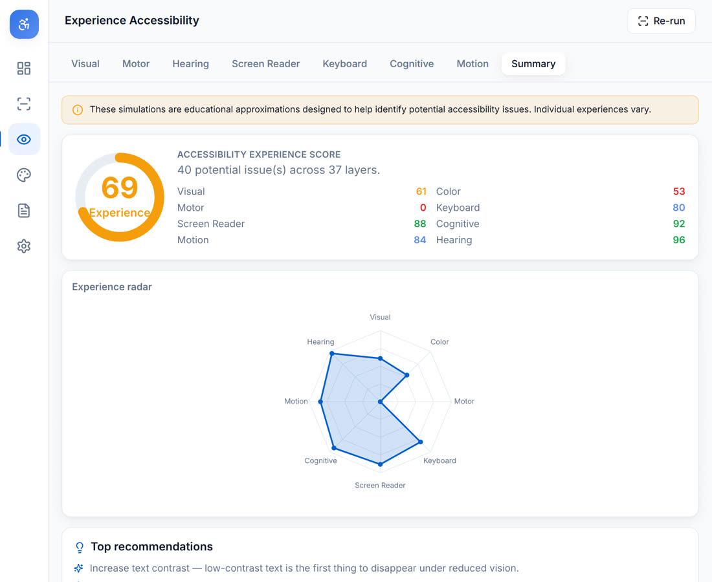

# Inclusive Audit

A professional accessibility auditor **and** a disability & accessibility experience
simulator, built directly into Figma. Designers get an accessibility score with
actionable, node-linked fixes — and can preview how people with different visual,
motor, and cognitive needs experience their screens.

<video src="./assets/inclusive-audit-demo.mp4" poster="./assets/poster.jpg" controls muted playsinline></video>

## The problem

Accessibility is usually checked at the very end — in code, by specialists, after
design decisions are locked in. Most Figma tools only measure color contrast, and
none help a designer *feel* what their interface is like for someone with low
vision, color blindness, a motor impairment, or a screen reader.

## The solution

Inclusive Audit brings an accessibility consultant into the canvas. Select any frame
and it runs eleven independent analyzers, scores the screen, links every issue to the
exact layer with a suggested fix — then lets you step into the shoes of users with
different needs through live, on-canvas simulations.

## What it does

### Accessibility Audit
- Overall score + grade with a per-category breakdown (visual, interaction,
  typography, color, components, inclusive design, cognitive, motion, content).
- Issue cards with severity, **WCAG references**, affected layers, a **Locate**
  button that selects the node, and one-click fixes (font size, line height, color).
- A full **color inventory** — contrast vs white/black, usage counts, WCAG rating,
  and accessible replacement suggestions.
- Export to **PDF, JSON, and CSV**.

### Experience Accessibility (the differentiator)
- **Visual simulations** rendered live on the exported frame: low vision, cataracts,
  glaucoma, macular degeneration, tunnel vision, diabetic retinopathy, retinitis
  pigmentosa, blurred vision, reduced contrast.
- **8 color-vision deficiencies** using scientifically-accepted transformation
  matrices, with a “compare all” gallery.
- **Screen-reader preview** — simulated reading order with roles and accessible
  names; step Previous/Next and each Figma layer is selected.
- **Keyboard** focus-path visualization, plus **motor**, **hearing**, **cognitive**,
  and **motion** heuristics.
- A **Summary** radar dashboard with an Accessibility Experience Score.

> Simulations are clearly labeled as **educational approximations** to help identify
> issues — never a claim of replicating an individual’s real experience.

## How it’s built

A thin Figma sandbox extracts a serializable snapshot of the frame (plus a capped
PNG for the visual simulator) and posts it to the UI over a typed message bridge. All
analysis runs as **pure, unit-tested modules** in the UI thread, so each analyzer and
simulation is independent, reusable, and testable without a running Figma instance.

**Stack:** TypeScript (strict) · React 18 · Figma Plugin API · Vite · TailwindCSS ·
Radix UI · Zustand · Framer Motion · Canvas 2D · Vitest.

## By the numbers
- **11** audit analyzers · **8** experience simulations · **18** vision variations
- Audits **500+ layers in under 5 seconds**
- Runs **fully offline** — no design data leaves Figma

## Screens

